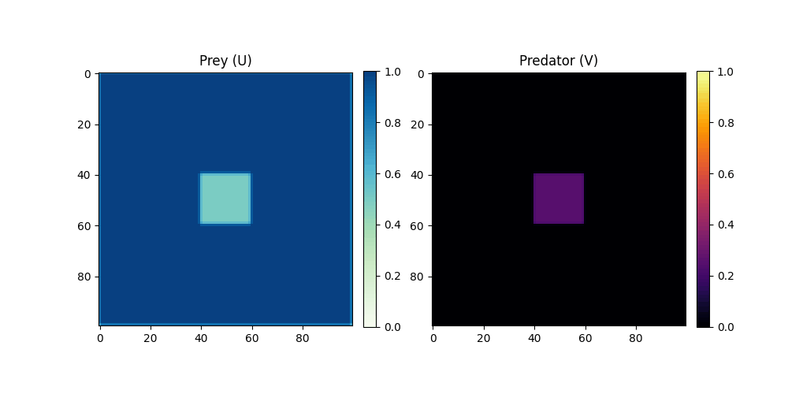

# Gray-Scott Reaction-Diffusion Model

This project models biological and chemical pattern formation (spots, stripes, division) from coupled reacting and diffusing substances.

* **Method**: Finite-difference integration of coupled reaction-diffusion partial differential equations (PDEs).
* **Result**: 
