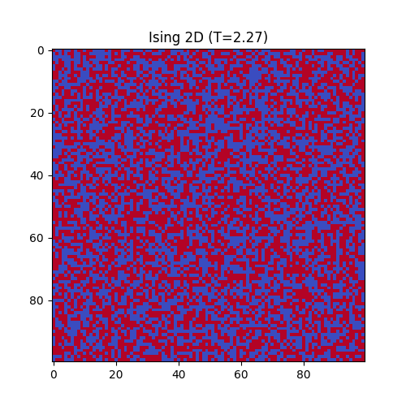

# 2D Ising Model Monte Carlo

This project simulates the ferromagnetic phase transition of a 2D spin lattice at varying temperatures.

* **Method**: Metropolis-Hastings Monte Carlo updates optimized and JIT-compiled using JAX.
* **Result**: 
