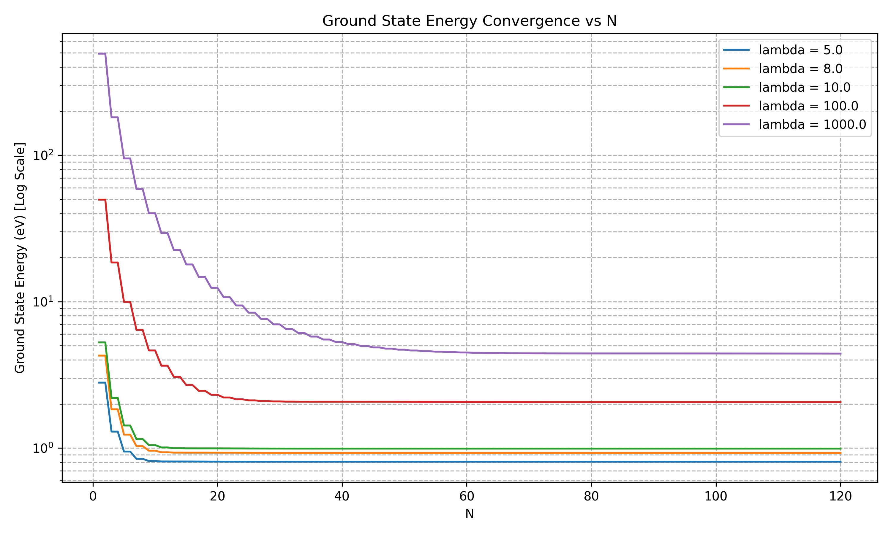

# Quantum Harmonic Oscillator

This project computes the energy states and wavefunctions of a 1D quantum harmonic oscillator perturbed by a quartic ($\lambda x^4$) potential.

* **Method**: Galerkin projection in the Fock (number state) basis, with an $O(N^3)$ to $O((N/2)^3)$ block-diagonalization speedup using parity symmetry.
* **Result**: 
